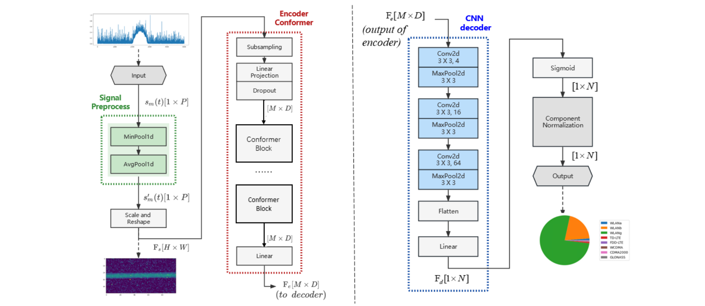
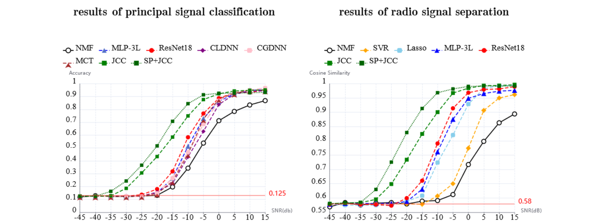
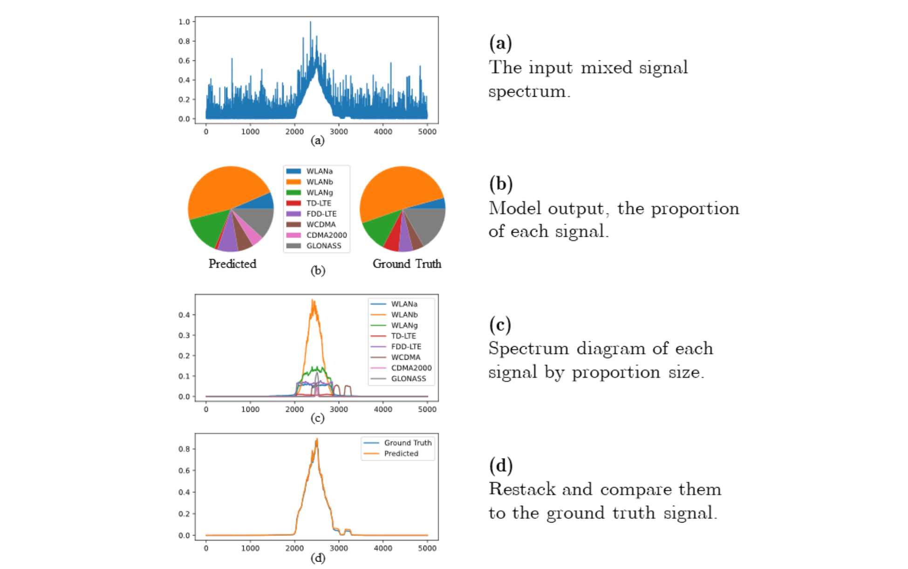

# JCCM Signals Recognition

## Poster

## Model Description

Joint Conformer and CNN model(JCCM) is proposed to separate and recognize the overlapping radio signals which are also unknown by the monitor node. JCCM utilizes the attention mechanism of conformer to encode signal spectrum into feature maps and decodes the feature maps into signal component proportions by perceiving the global and local features through convolutional neural networks (CNN). In addition, a signal preprocessing module is designed including MinPool and AvgPool layers for signal denoising .

The model was introduced in the paper [JCCM: Joint conformer and CNN model for overlapping radio signals recognition](https://doi.org/10.1049/ell2.13006) .

## Results

- the cosine similarity comparison of the above models for SNR between−45 dB and 15 dB. Compared with NMF, SVR and Lasso Regression, the use of deep neural network methods have better performance on recognition accuracy and restore the proportion of each signal component in the mixed signals. Our proposed model JCCM also shows more increasing performance in the low SNR (from−30 dB to−5dB) than MLP-3L and ResNet18. Moreover, applying SP module greatly improves the similarity performance due to the noise affect reduction on signal recognition.
- he principal signal classification accuracy of the above models with SNR between−45 dB and 15 dB. JCCM achieves significantly better results. The accuracy of JCCM is around 5% to 25% higher than ResNet18 when SNR is between−20 dB and 0 dB. When SNR is−25 dB, JCCM can maintain 30% classification accuracy even when other models fail, and it can reach 38% when using the SP module. This observation suggests that the enhancement on the uniformity of signal feature extraction by SP module has greatly facilitated the encoder and decoder in JCCM.

## Example

An example of scaling preservation through the overlapping radio signals separation in SNR=0dB by using JCCM is shown in this figure.

